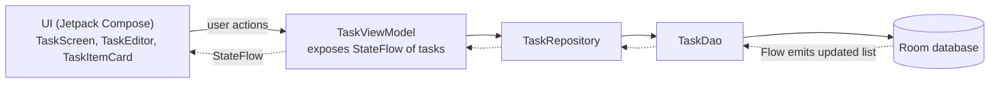
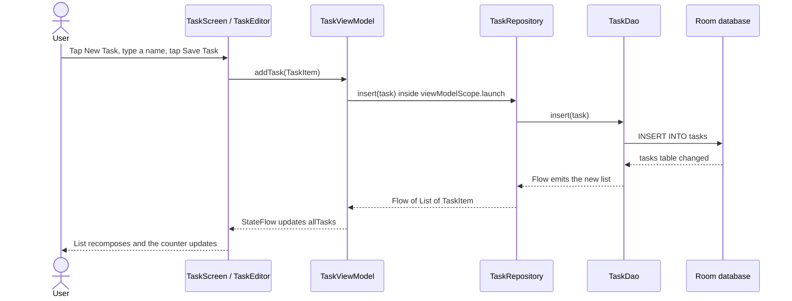

# PlanIt

A simple, clean task manager for Android, built with Kotlin and Jetpack Compose. Tasks are stored locally with Room, so they persist across app restarts.

<!-- Add screenshots after pushing: create a /screenshots folder and replace the paths below -->
<p align="center">
  
  
</p>

## Features

- Add, edit and delete tasks
- Mark tasks as done or not done
- Live "tasks remaining" counter in the top bar
- Local persistence with Room
- Empty state when there are no tasks
- Splash screen using the Android SplashScreen API

## Tech Stack

| Area | Technology |
|---|---|
| Language | Kotlin |
| UI | Jetpack Compose, Material 3 |
| Architecture | MVVM with the Repository pattern |
| Local database | Room |
| Async / reactive | Kotlin Coroutines, Flow, StateFlow |

## Architecture

The app follows MVVM, with a one-way data flow from the database to the UI:



Solid arrows show user actions travelling down to the database. Dotted arrows show data travelling back up to the UI.

- **View:** Composables only render state and report user actions.
- **ViewModel:** exposes tasks as a `StateFlow` and handles add, update and delete in `viewModelScope`.
- **Repository:** the single access point to the data source, keeping the ViewModel independent of Room.
- **Data:** a Room entity, DAO and database.

## App Flow

### Adding a task, end to end



1. The user taps **New Task**, and `TaskScreen` opens `TaskEditor` as a bottom sheet.
2. Tapping **Save Task** calls `onSaveClick` with the trimmed name, and `TaskScreen` calls `viewModel.addTask(...)`.
3. `TaskViewModel` launches a coroutine in `viewModelScope` and calls the repository.
4. `TaskRepository` forwards the call to `TaskDao`, which runs the insert on Room.
5. Room's `Flow` query on the `tasks` table re-emits automatically after the insert.
6. The new list travels back through the repository to the ViewModel's `StateFlow`.
7. `TaskScreen` collects the `StateFlow`, so Compose recomposes. The new card appears and the "tasks remaining" count updates.

The UI never reads from the database directly and never refreshes manually. It only reacts to state.

### All user actions

| User action | UI callback | ViewModel call | Result |
|---|---|---|---|
| Save a new task | `onSaveClick` | `addTask` | New card appears at the top |
| Edit a task | `onEditClick`, then `onSaveClick` | `updateTask` | Card text updates |
| Tick or untick a task | `onCheckboxClick` | `updateTask` (`isDone` flipped) | Card is struck through, counter changes |
| Delete a task | `onDeleteClick` | `deleteTask` | Card is removed |

Every action follows the same loop: **UI event → ViewModel → Repository → DAO → Room → Flow → StateFlow → UI**.

## Project Structure

```
com.aayush.planit
├── data/room_database    # TaskItem (entity), TaskDao, TaskDatabase
├── repository            # TaskRepository
├── viewmodel             # TaskViewModel, TaskViewModelFactory
├── ui
│   ├── components        # TaskItemCard, TaskTopAppBar
│   ├── screens           # TaskScreen, TaskEditor
│   └── theme             # Color, Type, Theme
└── MainActivity.kt
```

## Getting Started

1. Clone the repository:
   ```bash
   git clone https://github.com/Aayush049/PlanIt.git
   ```
2. Open the project in Android Studio.
3. Let Gradle sync, then run the app on an emulator or a physical device.

## Possible Improvements

- Due dates and reminder notifications
- Undo after deleting a task
- Dependency injection with Hilt
- Unit tests for the ViewModel
- Dark theme

## Author

**Ayush Srivastava** · [GitHub](https://github.com/Aayush049) · [LinkedIn](https://linkedin.com/in/ayush-srivastava049)
